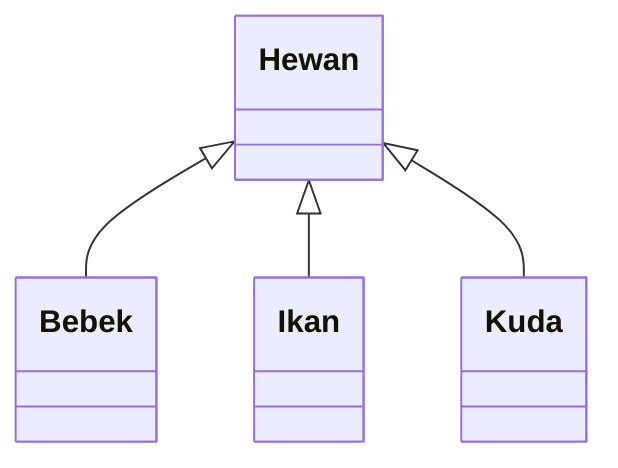

# Inheritance

- Salah satu dari 4 pilar pada _Object Oriented Programming_ (OOP), yakni _Inheritance_, _Encapsulation_, _Abstraction_, dan _Polymorphism_.

- Prinsip ini menyatakan bahwa suatu class dapat memiliki class turunan.

- Suatu class induk (_parent class_) akan dapat menurunkan **member** (properties dan methods) ke class anak (_child class_).

- Parent class dapat disebut juga base class atau superclass Child class disebut juga subclass.

