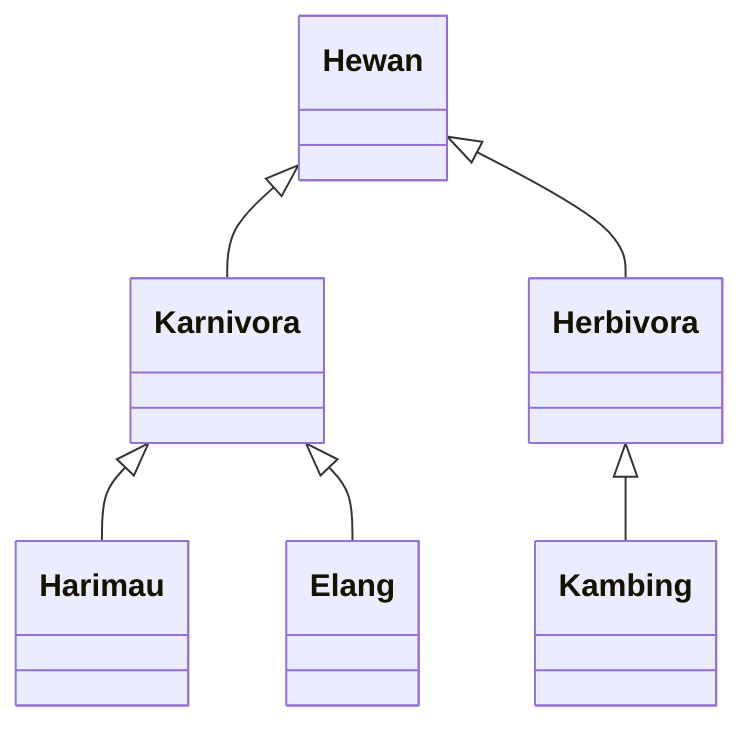

# Inheritance (cont.)

- Java hanya mengizinkan single inheritance, yakni subclass hanya dapat memiliki satu parent class.

- Satu parent class dapat memiliki banyak subclass yang disebut hierarchical inheritance.

- Satu subclass dapat memiliki subclass lagi, disebut multilevel inheritance.

- Java tidak mendukung multiple inheritance, yakni satu subclass memiliki lebih dari satu parent class, karena hal _multiple inheritance_ dapat menghasilkan .

- Diamond Problem adalah suatu kejadian dimana terdapat 1 child class yang meng-inherit _properties_ dan _methods_ dari 2 parent class yang memiliki method dengan nama & parameter yang sama. Akhirnya, terjadilah masalah ambiguitas karena sistem tidak tahu method milik siapa yang dipanggil. JADI, JAVA TIDAK MEMPERBLEHKAN MULTIPLE INHERITANCE, BAHKAN JIKA TIDAK TERDAPAT OVERLAPPING METHODS SEPERTI DIATAS.

